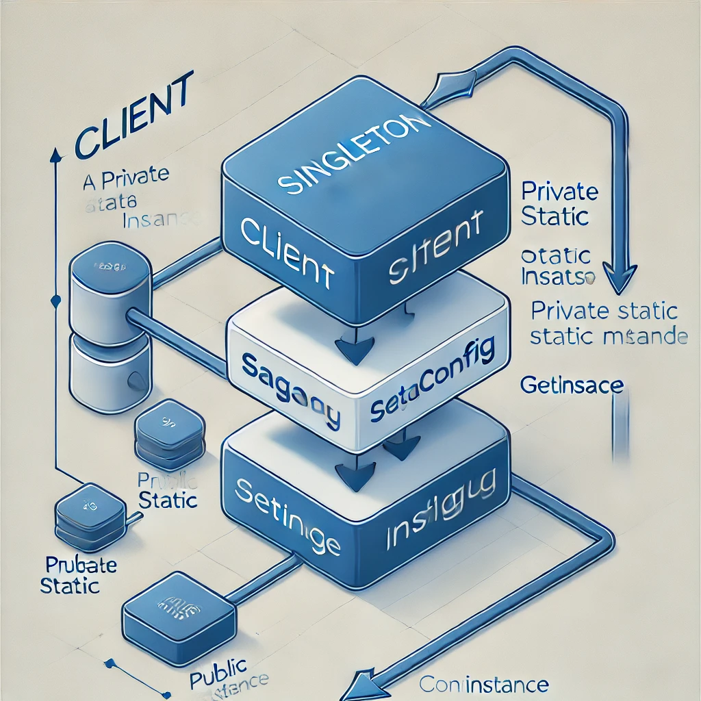

# Financial & Insurance Business Projects Simulation

This project simulates a business process workflow using Java design patterns such as Singleton, Strategy, and Saga. The simulation models a distributed transaction scenario with payment processing, inventory management, and notification services.

## Project Structure
- **com.ndbs.util:**  
  Contains utility classes, including the `SagaConfig` singleton for global configuration.
- **com.ndbs.step:**  
  Contains the various steps of the business process, such as payment, inventory, and notification.
- **com.ndbs.service:**  
  Contains the `OrderSaga` class that orchestrates the process flow and compensation logic.
- **com.ndbs.model:**  
  Contains the data models, including the `Order` class.

## Running the Application
1. **Clone the Repository:**
   ```bash
   git clone https://github.com/eccsm/bau-bc25
   ```
    
2. **Open the Project in Your IDE:**
- Import the project as a Maven or Gradle project.

3. **Run the Application:** 
- Locate the OrderSaga main class in the com.ndbs.service package.
- Run the main method to start the saga simulation.

4. **Observe the Output:**
- The application simulates order processing with steps for payment, inventory management, and notifications, along with compensation logic in case of errors.

## Code Highlights
- **Singleton Pattern:**

    Implemented in SagaConfig to provide a thread-safe, lazily initialized global configuration.

    

    
- **Strategy Pattern:**

    Used for flexible payment processing by allowing multiple payment strategies.

    

    
- **Saga Pattern:**

    Coordinates distributed transactions and includes compensation steps for robust error handling.

    
  

## Additional Information
- **Purpose:**
    
    This project is designed to demonstrate how common design patterns can be used to simulate complex business workflows in a distributed system.

- **Contributions:**

    Contributions and feedback are welcome. Please open an issue or submit a pull request with improvements or enhancements.

---

Feel free to adjust any details as necessary to best fit your session and project specifics!
